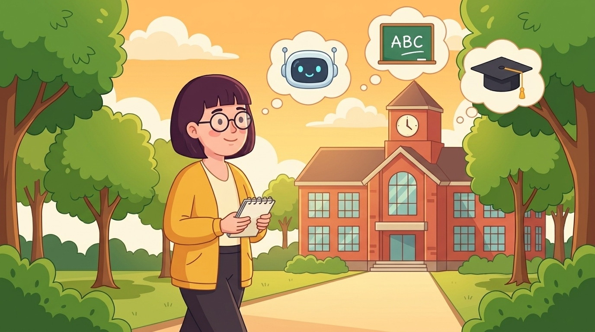
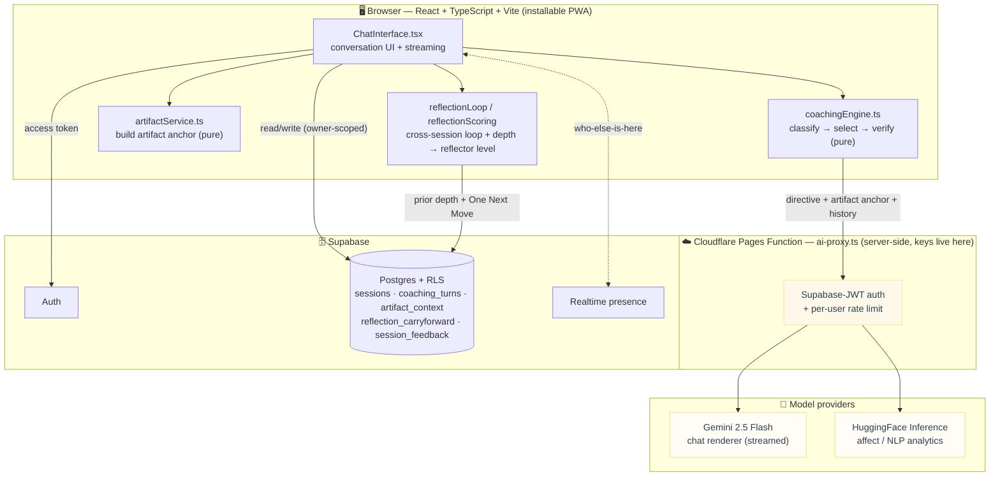
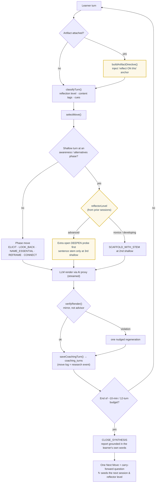

# 🍌 TINA - Teacher Identity Navigation Assistant

<div align="center">


**An AI-powered reflective coaching tool for educators exploring their teacher identity and AI integration practices**

[🏫 Class app](https://tina-adie.pages.dev) • [☁️ Keyless demo](https://tina-7kw.pages.dev) • [📖 Documentation](#features) • [🛠️ Setup](#getting-started)

<br/>

<a href="https://github.com/Educatian/TINA1.01/raw/main/public/video/tina-story-narrated.mp4">
  
</a>

▶ **[Watch the 16-second TINA story](https://github.com/Educatian/TINA1.01/raw/main/public/video/tina-story-narrated.mp4)** — a narrated cartoon walkthrough (campus → classroom AI discussion). Or **[play the live all-Cloudflare demo](https://tina-7kw.pages.dev)** (real AI on free Workers AI, no setup).

</div>

---

## ✨ What is TINA?

TINA is a **10-minute AI-guided conversation** designed to help teachers through a session of up to 12 TINA responses:

- 🪞 **Reflect** on their teaching identity and core values
- 🤖 **Explore** how AI is shaping their classroom practice  
- 🌍 **Consider** the societal implications of AI in education
- 📊 **Receive** a personalized reflection report with actionable insights

Built with the Nanobanana design system, TINA provides a warm, professional experience that feels like talking to a supportive colleague.

For the structured activity customization model that keeps one shared chatbot while allowing instructor-defined learning context, see [docs/experience-customization-spec.md](./docs/experience-customization-spec.md).

---

## 🎯 Key Features

| Feature | Description |
|---------|-------------|
| 💬 **Reflective Dialogue** | AI-guided conversation using Gemini 2.5 Flash, streamed with a live typing effect |
| 🔐 **Server-Side AI Proxy** | All Gemini/HuggingFace keys live in a Cloudflare Pages Function (`functions/api/ai-proxy.ts`) — never in the browser bundle. Supabase-JWT auth + per-user rate limiting |
| 📊 **Personalized Reports** | Detailed PDF reports with teacher profiling, grounded in the learner's own verbatim excerpts |
| 🔁 **Cross-Session Loop** | The next session opens by revisiting the previous report's "One Next Move" (+ a learner-chosen carry-forward question) — ALACT as a real cycle |
| 📈 **Reflection Trajectory** | Learners see their own reflection-depth bars (turn by turn) in the closing report |
| 🎓 **Teacher Clustering** | NLP-based classification into 3 teacher types |
| 🎤 **Voice Input** | Speech-to-text for natural conversation |
| 🧍 **TINA Character States** | Full-body avatar (idle/thinking/listening/walking/celebrating) driven by the selected coaching move; calm micro-motion, `prefers-reduced-motion` respected |
| 🧭 **Coaching-Move Engine** | Deterministic per-turn coaching moves (Korthagen ALACT + reflection levels) that steer the LLM *and* log research telemetry |
| 📎 **Artifact-Anchored Reflection** | Learners attach a real teaching artifact (lesson plan, student work, the AI prompt they used, or a link) and TINA grounds the whole conversation *on* it — evidence-based reflection, not abstract |
| 🪜 **Faded / Adaptive Scaffolding** | Scaffolding intensity fades by demonstrated reflective maturity (read from prior-session depth): advanced reflectors earn lighter, later prompts; novices get earlier, warmer support |

---

## 🗺️ Architecture & Flow Map

### System architecture

How a learner turn travels from the browser, through the key-safe AI proxy, to the model providers and back — with Supabase as the auth + data + presence backbone. AI keys never reach the browser bundle.



> A keyless, instantly-playable mirror of the app also runs all-Cloudflare (Pages + Worker + D1 + Workers AI) at **[tina-7kw.pages.dev](https://tina-7kw.pages.dev)** for the public demo.

### Per-turn reflection flow

Every learner turn runs the pure `classify → select → verify` pipeline. The two newest capabilities sit right in this path: the **artifact anchor** is injected before the move directive, and **faded scaffolding** branches the shallow-turn escalation on the learner's `reflectorLevel`.



The closing report's **One Next Move** becomes the next session's opening Action, and the learner's accumulated per-turn depth feeds `reflectorLevelFromHistory()` — so the cycle (and the scaffolding fade) compounds across sessions.

---

## 🧭 Coaching-Move Engine & Research Telemetry

TINA includes a **pure, unit-tested coaching engine** (`src/services/coachingEngine.ts`) built on a single design spine: **one "coaching move" is simultaneously (a) the control signal that shapes TINA's next reply and (b) the logged research event.** The LLM stays the *renderer*; move classification, selection, and verification live in deterministic code (the proven `classify → select → verify` pattern). The big TINA persona/system prompt is preserved — the engine only injects a short per-turn directive.

**Theory anchor — Korthagen's ALACT reflection cycle**
(Action → Looking back → Awareness of essential aspects → Creating alternative methods → Trial; Korthagen & Vasalos, 2005) plus **reflection levels** (technical → descriptive → critical; Van Manen, 1977; Hatton & Smith, 1995).

**The 9-move taxonomy** (single source of truth, consumed by selector, renderer directive, logger, and dashboard):

| Move | ALACT phase | Purpose |
|------|-------------|---------|
| `ELICIT_EXPERIENCE` | Action | Surface one concrete teaching moment |
| `LOOK_BACK` | Looking back | What happened / was wanted / felt / done |
| `NAME_ESSENTIAL` | Awareness | Name the identity / value / AI tension underneath |
| `DEEPEN_REFLECTION` | Awareness | Push descriptive → critical when a turn stays shallow |
| `SCAFFOLD_WITH_STEM` | Awareness | After repeated shallow turns, offer a sentence stem instead of another open why-probe (threshold **fades by reflector level**: 2nd shallow for novice/developing, 3rd for advanced) |
| `REFRAME_PERSPECTIVE` | Creating alternatives | Invite an alternative framing |
| `CONNECT_VALUE_TO_ACTION` | Trial | Connect the value to one small next move to try |
| `AFFIRM_AND_HOLD` | Looking back | Validate + hold a safe, low-confusion space |
| `CLOSE_SYNTHESIS` | Closing | End-of-session TINA Reflection Report |

- **Classify** (`classifyTurn`): lightweight, LLM-free heuristics → `{reflectionLevel, contentTags, cues}`.
- **Select** (`selectMove`): one move per turn; advances the ALACT cycle and lands `CLOSE_SYNTHESIS` near the ~10-minute / 12-turn budget; deepens shallow turns; holds the space on affect. **Faded scaffolding:** when an artifact is attached its anchor is injected first, and the shallow→stem escalation threshold fades by the learner's `reflectorLevel` (derived from prior-session depth via `reflectorLevelFromHistory`).
- **Verify** (`verifyRender`): a "mirror, not advisor" guard. On a violation, one nudged regeneration, else pass-through — never blocks the live class.

**Per-turn telemetry** is logged via `analyticsService.saveCoachingTurn(...)` into the `coaching_turns` table (the move log *is* the analytics data; no parallel pipeline). It is **best-effort and feature-detected**: with the SQL not applied or the engine disabled/erroring, the chat behaves exactly as before.

- **Flag / experiment mode:** `VITE_COACHING_ENGINE` is now an A/B assignment, not just on/off:
  - `on` (default) — everyone in **treatment** (engine runs); preserves prior live behavior.
  - `off` — everyone in **control** (no move directives; persona/analytics/extraction unchanged).
  - `rct` — deterministic **50/50 split** bucketed by a stable hash of `user_id` (same learner, same arm across sessions). See `src/services/experimentAssignment.ts`.
- **Schema:** apply `tina-coaching-telemetry.sql` (move log) and `tina-experiment.sql` (per-session arm assignment) in the Supabase SQL Editor (idempotent, additive-only, RLS = per-user + instructor-read). The Admin Dashboard **Coaching Moves** tab shows reflection-level distribution, move-usage frequency, ALACT phase coverage, per-learner trajectory, a **lexical-vs-Gemini classifier-agreement matrix** (measurement validity), and CSV/JSON export — with a clean "not enabled" state until the SQL is applied.
- **Research data dictionary:** every research table/field + suggested analyses are documented in [docs/research-data-dictionary.md](./docs/research-data-dictionary.md) for OSF preregistration/sharing.
- **Tests:** `npm test` (Node ≥ 22 `node --test`, 67 cases: classify/select/verify, every move reachable, shallow → `DEEPEN_REFLECTION` → `SCAFFOLD_WITH_STEM`, faded-scaffolding thresholds + reflector-level mapping, artifact-anchor directive grammar, end-of-time → `CLOSE_SYNTHESIS`, grounding excerpts, and RCT assignment determinism/balance).

---

## 🧠 NLP Analysis Pipeline

TINA includes advanced analytics powered by HuggingFace models:

- **Sentiment Analysis** - Emotional tone detection
- **6-Emotion Classification** - Joy, sadness, anger, fear, surprise, disgust
- **Self-Efficacy Detection** - Confidence level assessment
- **Discourse Type Analysis** - Reflection, concern, commitment, etc.
- **AI Attitude Profiling** - Enthusiast, skeptic, pragmatist, anxious

---

## 🏗️ Tech Stack

```
Frontend     │  React 18 + TypeScript + Vite
Styling      │  CSS with Nanobanana Design System
AI/Chat      │  Google Gemini 2.5 Flash
NLP          │  HuggingFace Inference API
Database     │  Supabase (PostgreSQL)
Auth         │  Supabase Auth
PDF          │  jsPDF
Hosting      │  Cloudflare Pages (+ Pages Functions)
```

---

## 🚀 Getting Started

### Prerequisites
- Node.js 18+
- npm or yarn

### Installation

```bash
# Clone the repository
git clone https://github.com/Educatian/TINA1.01.git
cd TINA1.01

# Install dependencies
npm install

# Create environment file
cp .env.example .env
```

### Environment Variables

Create a `.env` file with:

```env
# client-side (safe to expose)
VITE_SUPABASE_URL=your_supabase_url
VITE_SUPABASE_ANON_KEY=your_supabase_anon_key

# server-side ONLY — read by functions/api/ai-proxy.ts (Pages secrets in prod)
GEMINI_API_KEY=your_gemini_api_key
HF_API_KEY=your_huggingface_api_key
```

### Run Locally

```bash
npm run dev                       # UI only (no AI proxy)
npm run build && npm run cf:dev   # full app + the AI proxy Pages Function
```

Open [http://localhost:3000](http://localhost:3000) in your browser.

Deploying: `npm run cf:deploy` publishes the build (and `functions/`) to the
Cloudflare Pages project in `wrangler.toml`; see
[docs/cloudflare-hosting.md](./docs/cloudflare-hosting.md) for env/secrets.

Security notes:
- AI keys are **never** compiled into the client bundle. All Gemini/HuggingFace
  calls go through `/api/ai-proxy`, which verifies the learner's
  Supabase access token and enforces a per-user rate limit
  (apply `tina-api-proxy.sql` to enable the limit; auth is enforced regardless).
- Optional migrations: `tina-coaching-telemetry.sql` (move telemetry),
  `tina-api-proxy.sql` (rate limit), `tina-reflection-loop.sql` (carry-forward),
  `tina-artifact-anchor.sql` (persist the reflection artifact across resume),
  `tina-jol.sql` (judgment-of-learning), `tina-instructor-feedback.sql`,
  `tina-experiment.sql` (RCT arm), `tina-session-delete.sql` (lets learners
  bulk-delete their own sessions from My Account). All additive, idempotent,
  RLS-scoped; the app feature-detects any that are unapplied and falls back
  gracefully.

---

## 📁 Project Structure

```
src/
├── components/
│   ├── ChatInterface.tsx    # Main conversation UI
│   ├── Login.tsx            # Landing page with login
│   ├── ReportModal.tsx      # Reflection report display
│   ├── ProgressBar.tsx      # Session progress indicator
│   └── QuickReply.tsx       # Quick selection buttons
├── services/
│   ├── coachingEngine.ts    # Pure classify → select → verify (ALACT + faded scaffolding)
│   ├── artifactService.ts   # Artifact-anchored reflection (pure directive grammar)
│   ├── reflectionLoop.ts    # Cross-session loop + reflector-level (data access)
│   ├── reflectionScoring.ts # Pure depth scoring / JOL / reflector-level mapping
│   ├── nlpService.ts        # HuggingFace NLP integration
│   └── analyticsService.ts  # Affect-aware + coaching-move logging
├── hooks/
│   ├── useAuth.ts           # Authentication hook
│   └── useSession.ts        # Session management + artifact persistence
└── types/
    └── index.ts             # TypeScript definitions
```

---

## 🎨 Design Philosophy

TINA uses the **Nanobanana** design system:

- 🍌 Warm yellow primary colors for approachability
- 💬 Friendly, conversational UI elements
- ✨ Subtle animations for engagement
- 📱 Mobile-first responsive design

---

## 📊 Teacher Clusters

TINA classifies teachers into three profiles:

| Cluster | Description |
|---------|-------------|
| 🟠 **Thoughtful Explorer** | Ethically aware but hesitant about AI |
| 🔵 **Determined Pioneer** | Motivated but lacking resources/support |
| 🟢 **AI Champion** | Confident and prepared with AI tools |

---

## 🔐 Privacy & Ethics

- No personally identifiable information is collected
- Conversations are stored securely in Supabase
- Teachers can delete their data at any time
- AI responses prioritize safety and professional guidance

---

## 📝 License

MIT License - feel free to use and adapt for educational purposes.

---

## 🙏 Acknowledgments

Built for educational research by the Nanobanana team.

---

<div align="center">

**Made with 💛 for educators everywhere**

</div>
